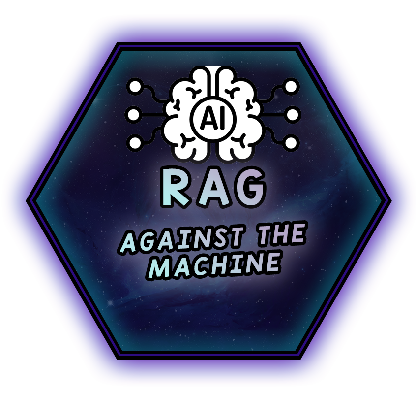

*This project has been created as part of the 42 curriculum by roandrie*

<p align="center">
  
</p>
<h3 align="center">
  <em>Will you answer my questions?</em>
</h3>

---

<div align="center">
  
  
  
</div>

## ⚠️ Disclaimer

- **Full Portfolio:** This repository focuses on this specific project. You can find my entire 42 curriculum 👉 [here](https://github.com/Overtekk/42).
- **Subject Rules:** I strictly follow the rules regarding 42 subjects; I cannot share the PDFs, but I explain the concepts in this README.
- **Archive State:** The code is preserved exactly as it was during evaluation (graded state). I do not update it, so you can see my progress and mistakes from that time.
- **Academic Integrity:** I encourage you to try the project yourself first. Use this repo only as a reference, not for copy-pasting. Be patient, you will succeed.

---

## ✏️ Quick Start

```bash
make  # install all dependencies and run the script

uv sync  # alternatively you can also use this

uv run python -m src  # Launch with the default value
```
> [!NOTE]
> If you don't have `uv` installed, run `make install`

---

## 📂 Description

Build a **Retrieval-Augmented Generation (RAG) system** that can answer questions about a codebase that will:
- Get the `vLLM` repository *(available in the project page on the intra)* and create a searchable knowledge base
- Search this knowledge base to find relevant code snippets and documentation for given questions
- Answer questions using an LLM with the retrieved context
- Evaluate your retriaval system's quality using recall@k metrics

### 🤖 What is a RAG

When creating an AI model, the first steps is to train it. There are two technique **Training** when the AI is fed with a huge amount of data. The LLM then remembers what it has leaderned but only knows the data it has been given. The other technique is **RAG**. Instead of feeding the model data directly, RAG gives the model access to an external source of information. Of course, the two techniques can be combined.
And a RAG have three key concepts:
- **Indexing**: the data is indexed, this step structures and organises the information to make it searchable later on.
- **Retrieving**: the model need to understand the question to search the database to retrieve the most useful snippets. Once done, it matches the query with the indexed database to choose the best results and pulls out the most relevant pieces of information.
- **Augmenting**: it can combine the retrieved information with its knowledge. However, we try to realy as much as possible on the retrieved data rather than the model's internal knowledge since mixing both may lead to outdated or hallucinatory answers. Starting from the retrieved results, the best thing to do is to clean and filter the retrieved information to remove irrelevant snippets and, then, insert into the context window.
- **Generating**: the final goal is the generate an answer. The AI will reads the context window, understands the task at hand, blends the knowledge, and generates the output.

### 📜 Summary:

todo

### 📝 Rules:

- Must be written in **Python >=3.10**.
- Must adhere to the **flake8** and **mypy** standard.
- Crash and leaks must be properly managed. All errors must be handled gracefully.
- Code must include type hints and docstrings *[(following PEP 257)](https://peps.python.org/pep-0257/)*.
- Use the model **Qwen/Qwen3-0.6B* or any other models as long as it is working with the first one.
- **uv** must be used as project and package manager.
- The system must providea **Command-Line Interface (CLI)** using Python Fire.
- Progress bars should be implemented for long-running operations using `tqdm`.

### 📮 Makefile:

This project must have a Makefile and the following rules:
- **install**: install project dependencies using **pip**, **uv** etc...
- **run**: execute the main script of the project.
- **debug**: run the main script in debug mode using Python's pdb.
- **clean**: Remove temporary files or caches.
- **lint**: execute the commands `flake8` . and `mypy . --warn-return-any
--warn-unused-ignores --ignore-missing-imports --disallow-untyped-defs
--check-untyped-defs`.
- **lint**: execute the commands `flake8 .` and `mypy . --strict`.

---

## 💡 Instructions

---

## ⚙️ How it works?

### 🧩 System architecture

### 🗿 Chunking Strategy

### 🥊 Retrieval method

### 📈 Performance analysis

### 📠 Design decisions

### 🏆 Challenges faced

### 🗨 Example usage

---

## 📚 Resources

### Global Documentation
| Resource | Description |
| :------: | :---------: |
| [Wikipedia - RAG (fr)](https://fr.wikipedia.org/wiki/G%C3%A9n%C3%A9ration_%C3%A0_enrichissement_contextuel) | Global explanation to know what a RAG is |
| [Blog - Stephane Robert (fr)](https://blog.stephane-robert.info/docs/developper/programmation/python/rag-introduction/) | How to make a RAG |

### Specific Libraries Documentation
| Resource | Description |
| :------: | :---------: |
| [Github.io - Python Fire](https://google.github.io/python-fire/guide/) | Documentation about `Python Fire` |

### Other
| Resource | Description |
| :------: | :---------: |
| [fcaval - github repo](https://github.com/fcaval42/RAG_AgainstTheMachine) | Help with the project |


### IA was use to:
- todo

---
