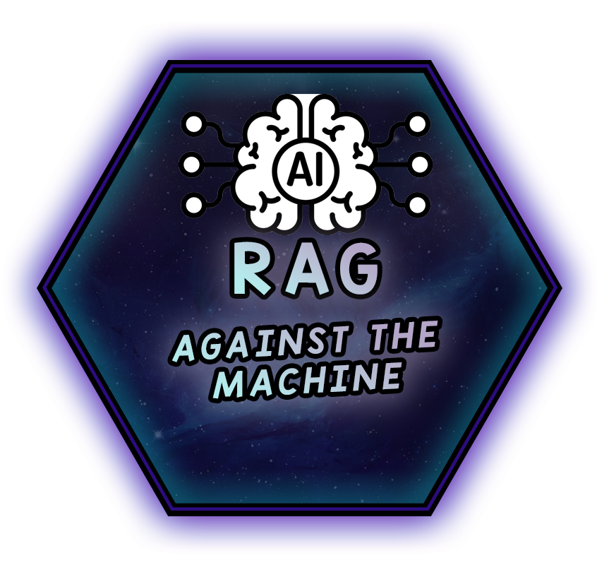
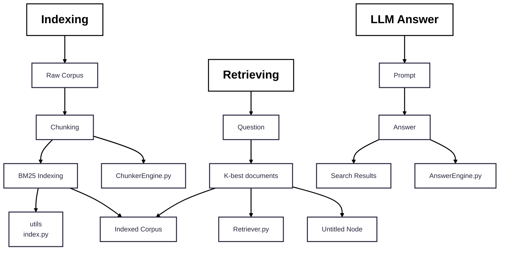

*This project has been created as part of the 42 curriculum by roandrie*

<p align="center">
  
</p>
<h3 align="center">
  <em>Will you answer my questions?</em>
</h3>

---

<div align="center">
  
  
  
</div>

## ⚠️ Disclaimer

- **Full Portfolio:** This repository focuses on this specific project. You can find my entire 42 curriculum 👉 [here](https://github.com/Overtekk/42).
- **Subject Rules:** I strictly follow the rules regarding 42 subjects; I cannot share the PDFs, but I explain the concepts in this README.
- **Archive State:** The code is preserved exactly as it was during evaluation (graded state). I do not update it, so you can see my progress and mistakes from that time.
- **Academic Integrity:** I encourage you to try the project yourself first. Use this repo only as a reference, not for copy-pasting. Be patient, you will succeed.

---

## ✏️ Quick Start

```bash
uv sync  # alternatively you can also use this

uv run python -m src  # Launch the CLI and see all commands

Available commands:
-- index (index the database)
-- search (retrieve the best documents for a question)
-- search_dataset (retrieve the bests documents for a given dataset)
-- answer (answer a question)
-- answer_dataset (answer a dataset)
-- evaluate (custom recall)
-- execute_pipeline (execute the index and search for the dataset)
```
> [!NOTE]
> If you don't have `uv` installed, run `make install`

---

## 📂 Description

Build a **Retrieval-Augmented Generation (RAG) system** that can answer questions about a codebase that will:
- Get the `vLLM` repository *(available in the project page on the intra)* and create a searchable knowledge base
- Search this knowledge base to find relevant code snippets and documentation for given questions
- Answer questions using an LLM with the retrieved context
- Evaluate your retriaval system's quality using recall@k metrics

### 🤖 What is a RAG

When creating an AI model, the first steps is to train it. There are two technique **Training** when the AI is fed with a huge amount of data. The LLM then remembers what it has leaderned but only knows the data it has been given. The other technique is **RAG**. Instead of feeding the model data directly, RAG gives the model access to an external source of information. Of course, the two techniques can be combined.
And a RAG have three key concepts:
- **Indexing**: the data is indexed, this step structures and organises the information to make it searchable later on.
- **Retrieving**: the model need to understand the question to search the database to retrieve the most useful snippets. Once done, it matches the query with the indexed database to choose the best results and pulls out the most relevant pieces of information.
- **Augmenting**: it can combine the retrieved information with its knowledge. However, we try to realy as much as possible on the retrieved data rather than the model's internal knowledge since mixing both may lead to outdated or hallucinatory answers. Starting from the retrieved results, the best thing to do is to clean and filter the retrieved information to remove irrelevant snippets and, then, insert into the context window.
- **Generating**: the final goal is the generate an answer. The AI will reads the context window, understands the task at hand, blends the knowledge, and generates the output.

### 📝 Rules:

- Must be written in **Python >=3.10**.
- Must adhere to the **flake8** and **mypy** standard.
- Crash and leaks must be properly managed. All errors must be handled gracefully.
- Code must include type hints and docstrings *[(following PEP 257)](https://peps.python.org/pep-0257/)*.
- Use the model **Qwen/Qwen3-0.6B* or any other models as long as it is working with the first one.
- **uv** must be used as project and package manager.
- The system must providea **Command-Line Interface (CLI)** using Python Fire.
- Progress bars should be implemented for long-running operations using `tqdm`.

### 📮 Makefile:

This project must have a Makefile and the following rules:
- **install**: install project dependencies using **pip**, **uv** etc...
- **run**: execute the main script of the project.
- **debug**: run the main script in debug mode using Python's pdb.
- **clean**: Remove temporary files or caches.
- **lint**: execute the commands `flake8` . and `mypy . --warn-return-any
--warn-unused-ignores --ignore-missing-imports --disallow-untyped-defs
--check-untyped-defs`.
- **lint**: execute the commands `flake8 .` and `mypy . --strict`.

---

## 💡 Instructions

To launch the RAG, you'll need a dataset and the vlmm available on the 42 intranet (alternatively, you can create your own dataset):
- Dataset go in *data/datasets*
- vllm can be a archive in the root, or a folder in *data/raw*

⚠️ Arguments are optionals

First, you need to index the dataset:
```bash
uv run python -m src index --max_chunk_size
  or
make index max_chunk_size=
```

Then, you retrieve the best k-documents among the given dataset:
```bash
uv run python -m search_dataset --dataset_path --k --save_directory
  or
make search_dataset dataset_path= k= save_directory=
```

You can also retrieve the best k-documents for a simple question:
```bash
uv run python -m search --query --k
  or
make search query= k=
```

Finally, ask the LLM to answers the questions for a dataset:
```bash
uv run python -m answer_dataset --student_search_results --save_directory --context_limit
  or
make answer_dataset student_search_results= save_directory= context_limit=
```

Or ask for a simple question:
```bash
uv run python -m answer --query --k --context_limit
  or
make answer query= k= context_limit=
```

You can evaluate a dataset with a custom recall:
```bash
uv run python -m evaluate --student_search_results_path --dataset_path
  or
make evaluate student_search_results_path= dataset_path=
```

---

## ⚙️ How it works?

The program reads and chunks the corpus from the target repository, creates an optimized index, retrieves the top-$k$ relevant source snippets for incoming questions, and uses an autoregressive model to produce grounded answers.

### 🧩 System architecture

The application is structured into four decoupled pipeline layers:


```mermaid
---
config:
  theme: redux
  layout: fixed
---
flowchart TB
    n4["BM25 Indexing"] --> n3["utils<br>index.py"] & n8["Indexed Corpus"]
    n2["Chunking"] --> n5["ChunkerEngine.py"] & n4
    n7["Raw Corpus"] --> n2
    n10["Question"] --> n9["K-best documents"]
    n9 --> n8 & n12["Retriever.py"] & n13["Untitled Node"]
    n15["Prompt"] --> n16["Answer"]
    n16 --> n11["Search Results"] & n17["AnswerEngine.py"]
    n14["`**LLM Answer**`"] --> n15
    n6["`**Retrieving**`"] --> n10
    n1["`**Indexing**`"] --> n7

    n4@{ shape: rect}
    n3@{ shape: rect}
    n8@{ shape: rect}
    n2@{ shape: rect}
    n5@{ shape: rect}
    n7@{ shape: rect}
    n10@{ shape: rect}
    n9@{ shape: rect}
    n12@{ shape: rect}
    n15@{ shape: rect}
    n16@{ shape: rect}
    n11@{ shape: rect}
    n17@{ shape: rect}
    n14@{ shape: rect}
    n6@{ shape: rect}
    n1@{ shape: rect}
    style n14 color:#000000,stroke:#000000,font-size:24px
    style n6 color:#000000,stroke:#000000,font-size:24px
    style n1 color:#000000,stroke:#000000,font-size:24px
```

1. **Chunking (`ChunkerEngine`)**: Ingests repository files and divides them into fixed segments while tracking exact document character offsets (`first_character_index`, `last_character_index`).
2. **Indexing (`indexer`)**: Serializes chunk text and metadata into a local JSON store, then tokenizes and builds a persistent BM25 index using English stemming.
3. **Retrieving (`RetrieverEngine`)**: Tokenizes input queries with the same stemming pipeline, evaluates query term frequency across the indexed documents, and pulls the top-$k$ highest-scoring chunks.
4. **Generation (`AnswerEngine`)**: Packs retrieved chunks into a system prompt, truncates the prompt to respect context boundaries, and runs batch inference with Hugging Face's text generation pipeline.

### 🗿 Chunking Strategy

Standard character-count splitting often breaks semantic context across syntax elements. The chunking layer uses specialized splitters depending on file formats:

- **Python (`.py`)**: Uses `RecursiveCharacterTextSplitter.from_language(Language.PYTHON)` with `chunk_overlap = 100`. This aligns split boundaries with language syntax (functions, classes, docstrings) while maintaining structural context across chunks.
- **Documentation (`.md`, `.txt`)**: Uses markdown-aware recursive splitting to keep headers, sections, and paragraphs intact, coupled with an overlap to avoid losing keywords that land on chunk boundaries.
- **Precise Offset Calculation**: Unlike naive character searches that fail when repetitive syntax blocks occur, offsets are computed sequentially using relative cursors to guarantee exact character ranges in evaluation metadata.

### 🥊 Retrieval method

The engine uses **`bm25s`**, an optimized implementation of the BM25 probabilistic relevance algorithm:

- **Stemming & Normalization**: Text is stemmed with `PyStemmer` (Snowball English) and filtered against English stopwords, matching morphologically related tokens (e.g., `retrieves`, `retrieval`, `retrieved`).
- **Memory & Storage Decoupling**: Document metadata and raw text are stored in a dedicated JSON database (`chunks_db.json`), while the BM25 inverted index only holds sparse token matrices to ensure lightweight loading during evaluation runs.
- **Scoring & Ranking**: The retriever calculates matching scores across chunks and outputs sorted `ChunkSearchResult` objects containing both the relevance score and document bounds.

### 📈 Performance analysis

Benchmark results obtained during the evaluation suite (tested on Ubuntu Linux):

- **Indexing**: ~8s for the complete corpus (far below the 300s upper limit).
- **Retrieval Speed**: 200 questions retrieved in ~8s across docs and code (threshold: <= 90s).
- **Retrieval Recall**:
  - **Docs Recall@5**: ~80% (passes the 0.80 target).
  - **Code Recall@5**: ~58% (passes the 0.50 target).
- **Batch Inference**: Grouping dataset evaluation queries into batches (`batch_size = 4`) maximizes GPU/VRAM utilization and reduces overall generation runtime.

### 📠 Design decisions

- **BM25 over Dense Embeddings**: High-dimensional neural embeddings (e.g., BERT, text-embedding-ada) require heavier dependencies and GPU overhead. Pure BM25 with stemming meets throughput limits (warm search under 90s) while keeping recall competitive on code syntax and technical documentation.
- **Pydantic Validation**: Strict schema enforcement (`MinimalSource`, `MinimalAnswer`, `StudentSearchResults`) guarantees input and output files conform to the project evaluation specifications.
- **Sub-string Artifact Stripping**: Generation prompts append `/no_think` and run-time post-processing strips `<think>...</think>` tags to prevent reasoning leakage when interacting with distilled reasoning models.

### 🏆 Challenges faced

- **Beginning of the project**: Knowing what to do first, where to go.
- **LLM creating**: Creating the LLM and using the Hugging Face pipelines.
- **Strict Typing with ML Libraries**: Hugging Face pipelines produce dynamic dictionary and nested list returns. Ensuring full `mypy --strict` compliance required defensive type assertions on pipeline tokenizers and explicit signature conversions across generation helpers.
- **Recall Boundary Losses**: Early indexing passes using `chunk_overlap = 0` cut technical concepts across split boundaries, dropping Recall@5 on text documentation. Introducing targeted overlaps and monotonic index stepping resolved the edge-case drops.

### 🗨 Example usage

#### 1. Indexing the corpus
```bash
uv run python -m src index --max_chunk_size=600
```

#### 2. Retrieving chunks for a single query
```bash
uv run python -m src search --query="How does the attention mask work in vLLM?" --k=5
```

#### 3. Generating an answer from retrieved sources
```bash
uv run python -m src answer --query="How does the attention mask work in vLLM?" --k=3 --context_limit=2048
```

#### 4. Running full pipeline on a dataset
```bash
uv run python -m src answer_dataset \
  --student_search_results="data/evaluations/search_results.json" \
  --save_directory="data/evaluations/answers/" \
  --context_limit=2048
```

---

## 📚 Resources

### 📝 Global Documentation
| Resource | Description |
| :------: | :---------: |
| [Wikipedia - RAG (fr)](https://fr.wikipedia.org/wiki/G%C3%A9n%C3%A9ration_%C3%A0_enrichissement_contextuel) | Global explanation to know what a RAG is. |
| [Blog - Stephane Robert (fr)](https://blog.stephane-robert.info/docs/developper/programmation/python/rag-introduction/) | How to make a RAG. Complete documentation about how to build it. |
| [Huggingface - Code a simple RAG from scratch](https://huggingface.co/blog/ngxson/make-your-own-rag) | Explanation of how to make a simple RAG. Useful to know simple things to make the RAG workings. |

### 📑 Documentation useful for the Indexing part
| Resource | Description |
| :------: | :---------: |
| [KMWLLC - TF-IDF vs BM25](https://kmwllc.com/index.php/2020/03/20/understanding-tf-idf-and-bm-25/) | Introduction to `TF-IDF` and `BM25` and comparaison between both. |
| [Huggingface - BM25s](https://huggingface.co/blog/xhluca/bm25s) | How to implement and use the BM25S.  |
| [Github - BM25S](https://github.com/xhluca/bm25s) | Github of the BM25S repo to know how to use it correctly. |
| [Documentation for `langchain` - text splitter](https://docs.langchain.com/oss/python/integrations/splitters) | Documentation for using `langchain-text-splitters`: used to chunk markdown and text files.|
| [Documentation for `langchain` - code splitter](https://docs.langchain.com/oss/python/integrations/splitters/code_splitter) | Documentation for using `langchain-text-splitters`: used to chunk python code file (and other programmation language). |

### 📑 Documentation for the LLM
| Resource | Description |
| :------: | :---------: |
| [Huggingface - Qwen3-0.6B](https://huggingface.co/Qwen/Qwen3-0.6B) | Global documentation about the model ` Qwen3-0.6B` |
| [Huggingface - Github](https://github.com/huggingface/transformers/blob/main/docs/source/en/model_doc/qwen3.md) | Using Qwen3 with pipeline |
| [Huggingface - Transformers](https://huggingface.co/docs/transformers/en/quicktour) | How tu use the transformers module |

### 🐍 Specific Libraries Documentation
| Resource | Description |
| :------: | :---------: |
| [Github.io - Python Fire](https://google.github.io/python-fire/guide/) | Documentation about `Python Fire` for Command Line Interface. |
| [W3Schools - `os.walk`](https://www.w3schools.com/python/ref_os_walk.asp) | How to use `os.walk` for the indexing part. |
| [Datacamp - `tqdm`](https://www.datacamp.com/tutorial/tqdm-python?dc_referrer=https%3A%2F%2Fwww.google.com%2F) | How to use the `tqdm` library to implement progress bar. |

### ✏️ Other
| Resource | Description |
| :------: | :---------: |
| [fcaval - github repo](https://github.com/fcaval42/RAG_AgainstTheMachine) | 42 student repo helping me with the global architecture when stuck. |
| [sousampere - github repo](https://github.com/sousampere/42_RAG_2.0/blob/main/src/llm.py) | 42 student repo helping me with the global architecture when stuck. |
| [Documentation for `ruff`](https://docs.astral.sh/ruff/) | Official documentation for the `ruff` library which is a code formatter. Faster than flake8 and can format the code itself |


### IA was use to:
- **As a teacher**: providing help when stuck and specify thing of the project, or subject I wasn't sure to understand. Giving me advices and tips and how to code some part, or for upgrading.
- **As a debugger**: helping me debug when something isn't working and when I don't understand why after searching for a while.
- **Help me with the creating of the LLM**: documentation of how to use Hugging Face and the pipelines.
- **Docstrings**: create the docstrings.
- **README**: complete the README.

---
